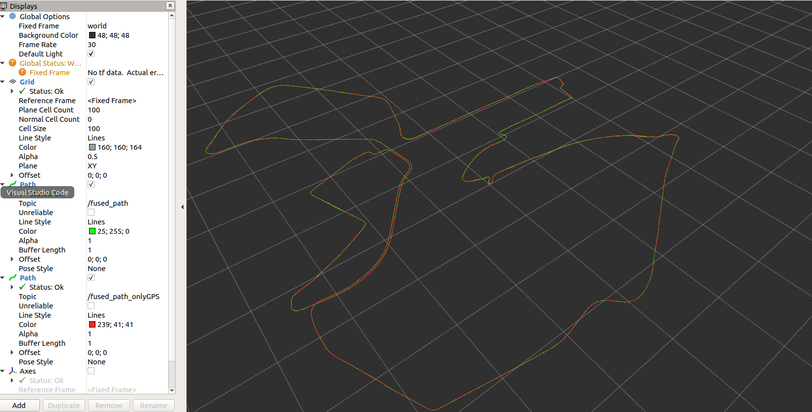
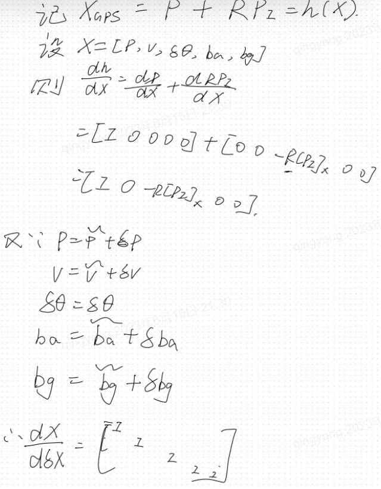

# error-state-KF-with-imu-and-gps-fusion
This is a modified version  for  "https://github.com/ydsf16/imu_gps_localization", which is a c++ project(Note that most of other package for nmea are python files).  Including mainly:

1. ekf2d is my little modification version(roslaunch ekf2d ekf2d.launch), and imu_gps_relocalization is the primitive code from url above.
2. Integrate project concerned with nmea for parsing gps data; So you can run "catkin_make" directly and quickly run ros node. Of course, you need to download related rosbag file.
3. Add gps path in the ros_wapper for comparing the imu fusion result with primitive gps result, like below(the red is gps path, and another is fusion path. This data has a good signal strength of gps, thus, two lines intertwine together.)

4. Add judgement before inverse () when updating, and avoid to introduce nan value.
5. In the correction equation, give the inference of H: 
6. Relax the gps status condition during initializtion when the environment is not very good.
7. Reduce bad Gps correction to imu trajectory.

Maybe my operation is not good and even wrong, please feel free to contact me at 1183732164@qq.com
